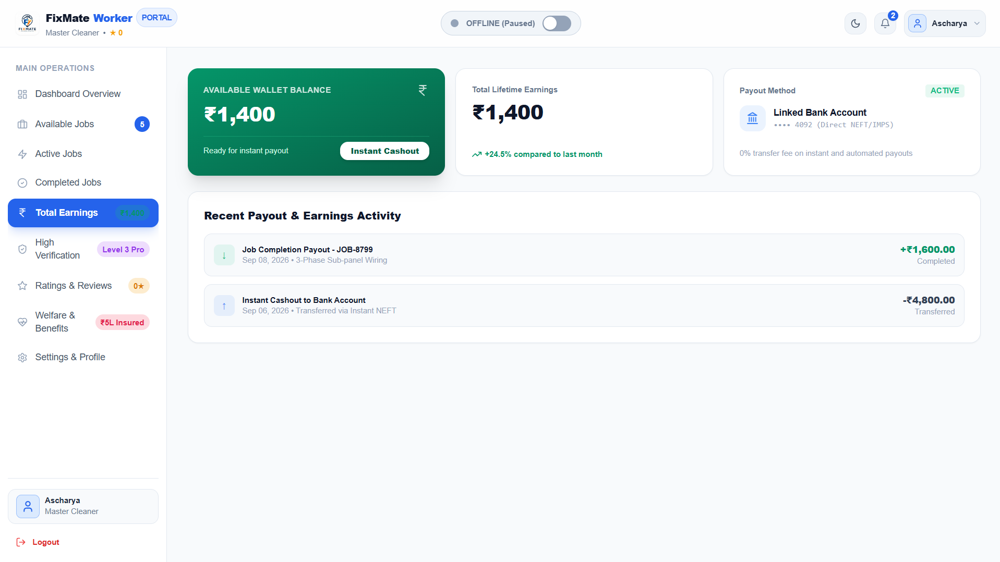

# FixMate — Cooperative Service Marketplace

## Smart India Hackathon 2026

| **Problem Statement ID** | 26089 |
| ------------------------ | ----- |
| **Problem Statement Title** | Cooperative Gig Services Platform for Household & Community Services |
| **Organization** | Ministry of Cooperation |
| **Department** | National Council for Cooperative Training (NCCT) |
| **Category** | Software |
| **Theme** | Agriculture, FoodTech & Rural Development |

---

# Problem Statement

## Background

Labour Cooperative Federations and Labour Cooperative Societies possess a large pool of skilled workers such as electricians, plumbers, carpenters, painters, domestic helpers, caregivers, drivers, gardeners, cleaners and technicians.

However, they lack a structured digital platform to connect these workers with households and institutions requiring such services.

Private platforms currently dominate this market, while cooperative workers often remain underutilized despite having skills and local presence.

## Problem

The objective is to develop a cooperative-owned digital service marketplace platform that enables Labour Cooperative Federations and Labour Cooperative Societies to provide verified household and community services while ensuring:

- Fair wages
- Worker welfare
- Consumer trust

## Expected Solution Features

The proposed platform is expected to support:

- Service provider registration and verification
- Worker skill profiling and certification
- Customer booking and scheduling system
- Geo-location based service matching
- Digital payments and invoicing
- Rating and feedback mechanism
- Worker welfare and insurance integration
- Emergency and on-demand service booking
- Cooperative federation administration dashboard
- Multilingual mobile application
- AI-based demand forecasting and workforce allocation

## Technology Components

The problem statement identifies the following technology components:

- Mobile Applications
- Artificial Intelligence (AI)
- Geo-Spatial Technology
- Digital Payment Systems
- Cloud Computing
- Software

---

# Proposed Solution

FixMate is a cooperative-owned digital service marketplace designed to connect verified local service workers with households and institutions requiring services.

The platform brings together customer, worker and administrative interfaces with a backend API, PostgreSQL database and AI services.

The solution focuses on:

- Verified worker profiles
- Skill-based service matching
- Location-aware matching
- Service booking and scheduling
- Digital payment flow
- Ratings and reviews
- Worker welfare and insurance support
- AI-based demand forecasting
- Workforce allocation
- Cooperative administration

---

# Core Features

## Verified Workers

Workers can have profiles containing information such as:

- Skills
- Experience
- Certifications
- Availability
- Location
- Ratings

Worker verification helps improve trust between customers and service providers.

## Smart Matching

The platform can match service requirements with suitable workers using factors such as:

- Worker skills
- Service requirements
- Location
- Availability
- Worker ratings

## Service Booking

Customers can request services and workers can manage their assigned or available jobs through the platform.

## Ratings and Reviews

Customers can provide ratings and reviews after completing a service.

This helps improve transparency and provides useful feedback about service quality.

## Digital Payments

The platform includes a digital payment flow to support transactions between customers and service providers.

## Worker Welfare and Insurance

The platform is designed to support worker welfare through features related to insurance and other welfare-oriented services.

## Demand Forecasting

The AI component analyses demand-related data to estimate future service requirements.

## Workforce Allocation

The allocation component uses demand and worker information to support better distribution of available workers across service requirements.

---

# System Architecture

```text
                    FIXMATE PLATFORM
                           │
          ┌────────────────┼────────────────┐
          │                │                │
       Customer          Worker           Admin
       Frontend          Frontend         Dashboard
          │                │                │
          └────────────────┼────────────────┘
                           │
                     Backend API
                  Node.js + Express.js
                           │
                         Prisma
                           │
                     PostgreSQL
                           │
             ┌─────────────┴─────────────┐
             │                           │
          AI Service                Application Data
        Python + FastAPI
             │
       ┌─────┼─────────────┐
       │     │             │
    Matching Forecasting Allocation
```

## The main components are:
```text
Frontend
   |
   v
React-based user interfaces
   |
   v
Backend API
   |
   +---- Authentication
   +---- Workers
   +---- Services
   +---- Bookings
   +---- Reviews
   +---- Matching
   |
   v
PostgreSQL Database
   |
   v
AI Services
   |
   +---- Matching
   +---- Demand Forecasting
   +---- Workforce Allocation
```
---

# AI Components

The AI layer is developed using Python and provides services for worker matching, demand forecasting and workforce allocation.

## Worker Matching

The matching component helps identify suitable workers based on service requirements and available worker information.

Factors can include:

- Worker skills
- Service requirements
- Location
- Availability

## Demand Forecasting

The forecasting component analyses available demand-related data to estimate future service requirements.

This can help the platform understand where and when additional workforce capacity may be required.

## Workforce Allocation

The allocation component uses demand and worker information to support better distribution of available workers across service requirements.

---

# Technology Stack

## Frontend

- JavaScript
- React
- HTML
- CSS

## Backend

- Node.js
- Express.js

## Database

- PostgreSQL

## ORM

- Prisma ORM

## AI Service

- Python
- FastAPI
- Uvicorn

---

# Authentication and Security

The backend provides authentication and authorization functionality for platform users.

Sensitive configuration such as database credentials, JWT secrets and other environment variables should be stored locally using `.env` files.

These files are excluded from the Git repository using `.gitignore`.

---

# Installation and Setup

## Prerequisites

Make sure the following are installed on your system:

- Node.js
- npm
- PostgreSQL
- Python
- Git

## Clone the Repository

Open a terminal or PowerShell window and run:

```bash
git clone https://github.com/shivam16-apr/Cooperative-platform.git
```

Then move into the project folder:

```bash
cd Cooperative-platform
```

---

## Backend Setup

Open a terminal inside:

```text
Cooperative-platform/src/backend
```

Install the required Node.js packages:

```bash
npm install
```

Create a local `.env` file inside:

```text
Cooperative-platform/src/backend
```

Configure the required environment variables such as the database connection string and JWT secret.

Configure PostgreSQL and Prisma before starting the backend server.

Start the backend server using the command configured in the backend `package.json`.

---

## AI Setup

Open a terminal inside:

```text
Cooperative-platform/src/ai
```

Create a Python virtual environment:

```bash
python -m venv venv
```

Activate the virtual environment on Windows:

```bash
venv\Scripts\activate
```

Install the required Python dependencies.

The AI service can then be started using FastAPI and Uvicorn according to the configuration in the AI service.

---

## Frontend Setup

The project contains separate frontend interfaces for different platform users.

### Admin Frontend

Open a terminal inside:

```text
Cooperative-platform/src/admin
```

Install the dependencies:

```bash
npm install
```

Start the development server:

```bash
npm run dev
```

### Worker Frontend

Open a terminal inside the Worker frontend directory:

```text
Cooperative-platform/src/worker
```

Install the dependencies:

```bash
npm install
```

Start the development server:

```bash
npm run dev
```

### Customer Frontend

Open a terminal inside the Customer frontend directory:

```text
Cooperative-platform/src/customer
```

Install the dependencies:

```bash
npm install
```

Start the development server:

```bash
npm run dev
```


# API Documentation

The current API documentation is available in:

```text
apidocumentation.md
```

The documentation contains information about the available backend API endpoints.

---

## Screenshots

### Worker Interface

#### Worker Onboarding & Authentication

The Worker interface provides a guided onboarding flow for new workers, along with login access for existing workers.

**1. Worker Login & Profession Selection**

The main entry screen allows new workers to select their profession, while existing workers can access the login option.


**2. Personal Information**

New workers provide their basic information, including their name and phone number.


**3. Work Preferences & Service Details**

Workers provide their operating city, experience, maximum service radius and hourly charges.


**4. Identity Verification & Security**

Workers complete the verification process and create a secure 4-digit PIN for account access.


#### Worker Dashboard

The Worker Dashboard provides an overview of the worker's activities and important account information.


#### Worker Earnings

Workers can view and track their earnings through the dedicated Earnings interface.



> Screenshots for the Customer and Admin interfaces will be added as those modules are finalized.


# Project Vision

FixMate aims to create a trusted and cooperative digital ecosystem for local service workers and customers.

The platform combines verified workers, smart matching, AI-based demand insights and workforce allocation to support a more organized local service marketplace.

The long-term vision is to provide workers with better access to service opportunities while helping customers and institutions find suitable and reliable service providers.

---

# Future Scope

Potential future improvements include:

- More advanced worker matching
- Improved demand forecasting
- Real-time worker availability
- Enhanced worker welfare services
- Insurance integration
- Improved administrative analytics
- Mobile application support
- More detailed service and workforce analytics

---

# Team

## SIH 2026 Project Team

**Project:** FixMate — Cooperative Service Marketplace

| Team Member | Role / Contribution |
|---|---|
| Shivam | AI Development — Worker Matching, Demand Forecasting and Workforce Allocation |
| Aakansha | Backend Development and Database — API Development, Authentication, Database and Backend Integration |
| Abhishek | Customer Frontend — Landing Page and Core Customer User Interface |
| Rishikant | Admin Frontend — Complete Admin Dashboard and Administrative User Interface |
| Ascharya | Worker Frontend, Quality Assurance and Payment Flow |
| Varun | Worker Frontend and Quality Assurance |

---

# SIH 2026

Developed as part of the Smart India Hackathon 2026 project.